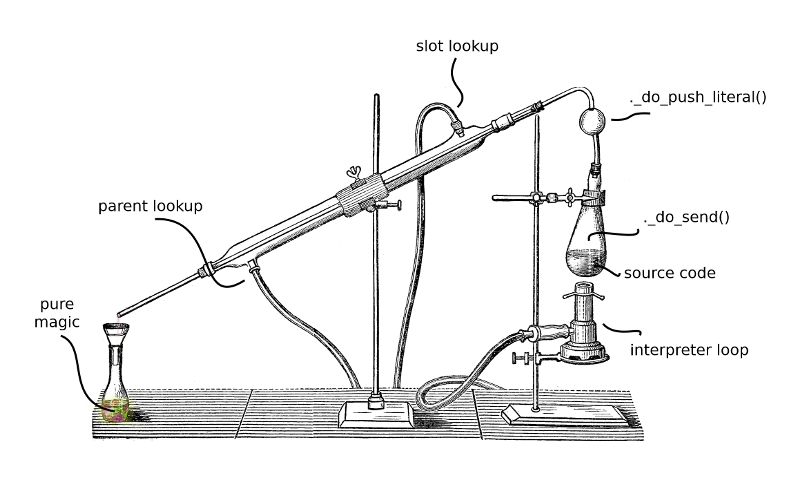

.. image:: https://api.codacy.com/project/badge/Grade/14d07be60e7d4ae393638b8a87bc3de4
   :alt: Codacy Badge
   :target: https://app.codacy.com/app/Bystroushaak/tinySelf?utm_source=github.com&utm_medium=referral&utm_content=Bystroushaak/tinySelf&utm_campaign=badger

tinySelf is an experimental programming language inspired by the `Self lang <http://www.selflanguage.org/>`_, with the emphasis on the word *experimental*.

I would like something like the glasswork rack you know from the chemistry pictures, but for computation.

The point of the experiment is not in the language itself, but in all kind of different stuff that can be done with it. tinySelf should be lightweight, compact, collapsible, interchangeable, universal computational apparatus for anything I can possibly hope to make.

Articles
++++++++

* `Github Wiki <https://github.com/Bystroushaak/tinySelf/wiki>`_
* `Articles about tinySelf <http://blog.rfox.eu/Bystroushaak%20s%20blog/English%20section/tinySelf.html>`_

Planning
++++++++

See

* https://github.com/Bystroushaak/tinySelf/projects/1
* https://github.com/Bystroushaak/tinySelf/projects/2
